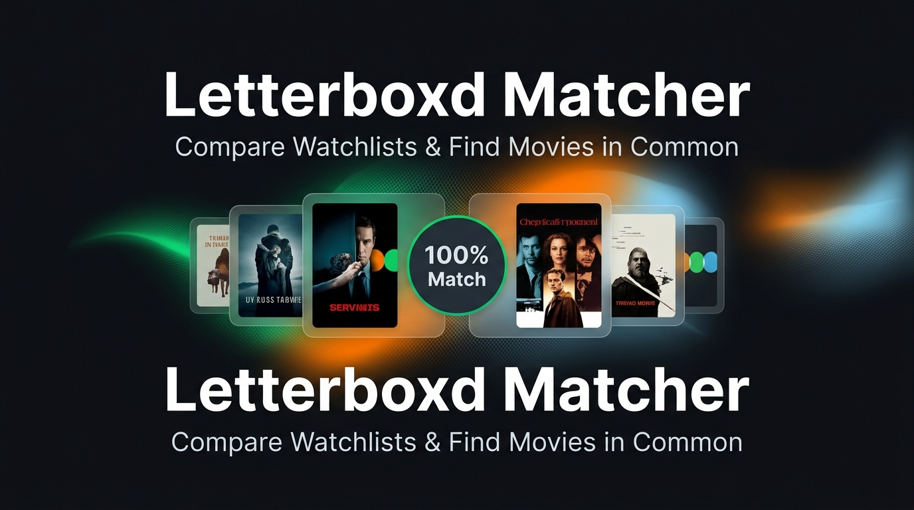

# 🎬 Letterboxd Matcher

> **Descubrí qué películas tienen en común vos y tus amigos en Letterboxd** — sin registrarte, sin API key, sin backend propio que mantener.

**[🌐 Ver demo en vivo →](https://agusre.github.io/letterboxd-matchinglist/)**



---

## 📌 ¿Qué es Letterboxd Matcher?

**Letterboxd Matcher** es una aplicación web 100% estática que compara las **Watchlists** y **Listas públicas** de hasta 5 usuarios de [Letterboxd](https://letterboxd.com) y encuentra al instante las películas que todos quieren ver.

Ideal para cuando un grupo de amigos tiene que decidir qué ver juntos: en segundos ves qué coincide en las watchlists de todos, qué es exclusivo de cada uno, podés compartir el resultado con un enlace directo, exportarlo a CSV para tu colección, o resolver el empate con el modo interactivo **Top 5 Eliminator**.

---

### ✨ Características principales

| Feature | Detalle |
|---|---|
| 🔍 **Comparación instantánea** | Hasta 5 usuarios o listas públicas simultáneamente |
| 📋 **Dos modos de origen** | Watchlist personal (`@usuario`, `usuario` o URL) o lista pública específica |
| ⚡ **Validación en tiempo real** | Validación instantánea (debounce) con borde verde/rojo y mensajes contextuales claros |
| 🔄 **Retry selectivo por usuario** | Si una lista falla o es privada, los usuarios exitosos se preservan y podés reintentar puntualmente en esa fila |
| 🕒 **Historial persistente** | Guarda hasta 10 comparaciones en `localStorage` (`lbmatch_v1_history`) con recarga en 1 clic |
| 🧹 **Precarga y Limpieza** | Recuerda la última búsqueda al abrir la web y permite resetear inputs con el botón "Limpiar" |
| 🔗 **Compartir vía URL** | Parámetros automáticos (`?mode=watchlist&u=usuario1,usuario2`) y botón "Copiar link" con feedback visual |
| 📥 **Exportar a CSV** | Descarga las películas en común en formato CSV con codificación UTF-8 BOM para compatibilidad total con Microsoft Excel |
| 📡 **Indicador de salud de proxies** | Monitoreo en vivo durante la búsqueda y pill persistente en el footer con latencia y estado |
| ♿ **Accesibilidad completa (a11y)** | Navegación completa por teclado (Tab, flechas, Supr/Espacio) en el Top 5 Eliminator y en las pestañas |
| 🎞️ **Paginación automática** | Extrae **todas** las páginas de cada lista (hasta 30 páginas), no solo las primeras 28 |
| 🖼️ **Pósters, sinopsis y ratings reales** | Enriquecimiento on-demand vía `og:image`, `og:description` y `ratingValue` |
| 🎲 **Top 5 Eliminator** | Modo de decisión interactivo con eliminación de tarjetas, foco accesible y confetti |
| 📊 **Películas únicas** | Pestañas con teclado para explorar lo exclusivo de cada usuario |
| 🌐 **SEO Técnico y Schema.org** | Metadatos estáticos, JSON-LD (`WebApplication`, `WebSite`, `FAQPage`), Open Graph y `sitemap.xml` |
| 💾 **Caché client-side** | Listas (30 min) y metadata de films (24 h) cacheadas localmente |
| 💯 **100% estático** | HTML, CSS y Vanilla JS puro, sin build step, listo para GitHub Pages |

---

## 🛠️ Cómo funciona la extracción

Letterboxd no ofrece una API pública sin aprobación previa, por lo que la app obtiene los datos scrapeando el HTML público de cada perfil mediante una cadena inteligente de proxies CORS:

```
Usuario ingresa URL o username de Letterboxd (o abre un link compartido ?mode=...&u=...)
        ↓
App valida en tiempo real y expande username → URL canónica de watchlist
        ↓
App construye URLs de paginación (/page/1/, /page/2/, …)
        ↓
Solicitud enviada al proxy CORS (Worker propio / servidor local → AllOrigins fallback)
        ↓  [el proxy hace la petición a Letterboxd por nosotros, server-side]
HTML de la página devuelto como texto y analizado con DOMParser
        ↓
Extracción de elementos LazyPoster:
  <div data-component-class="LazyPoster"
       data-item-slug="princess-mononoke"
       data-item-name="Princess Mononoke (1997)"
       data-target-link="/film/princess-mononoke/" …>
        ↓
Lista de objetos { id (slug), title, year, poster, link }
        ↓
Algoritmo de intersección por slug → películas en común + únicas por usuario
        ↓
Render de tarjetas, actualización de URL compartible, exportación CSV y guardado en Historial
```

---

## 🔗 Compartir comparaciones vía URL

Podés compartir cualquier búsqueda o guardarla en tus marcadores simplemente pasando los parámetros en la URL:

```
https://agusre.github.io/letterboxd-matchinglist/?mode=watchlist&u=agusre,edgarwright
```

- **Parámetros admitidos:**
  - `mode`: `watchlist` o `list`.
  - `u` o `users`: nombres de usuario o URLs separadas por coma.
- **Botón "Copiar link":** En la cabecera de resultados comunes, hacé clic en **Copiar link** para copiar la URL lista para compartir con tus amigos. El botón confirmará con una animación y el texto `¡Copiado! ✓`.

---

## 📥 Exportar resultados a CSV

Para guardar o analizar las películas coincidentes:
1. Realizá una comparación exitosa.
2. En la sección de películas en común, hacé clic en **Exportar CSV**.
3. Se descargará automáticamente un archivo con el formato:
   ```
   letterboxd_match_usuario1_usuario2_2026-08-28.csv
   ```
4. **Compatibilidad:** El archivo incluye **UTF-8 BOM (`\uFEFF`)**, lo que garantiza que caracteres con acentos, eñes y caracteres especiales se abran correctamente en **Microsoft Excel**, Google Sheets y Numbers.

---

## 🎲 Top 5 Eliminator

Para esos momentos en los que el grupo no sabe qué elegir:

1. **Comparar listas**: ingresá al menos 2 usuarios o listas y hacé clic en "Comparar Listas".
2. **Abrir el modo**: en la barra de estadísticas de resultados, hacé clic en **🎲 Top 5 Eliminator**.
3. **Enriquecimiento de datos**: se seleccionan hasta 5 películas al azar y se obtienen sus pósters en alta resolución, sinopsis completa y calificación de estrellas.
4. **Descartar películas**:
   - Con mouse: hacé clic en la **×** de cada tarjeta.
   - Con teclado: navegá con las flechas (**←** / **→**) y presioná **Supr**, **Retroceso** o **Espacio** para descartar.
5. **Ganador**: al quedar 1 sola película, se activa el banner de ganador con confetti y un enlace directo a Letterboxd.

---

## 🔍 SEO Técnico y Arquitectura Semántica

La aplicación cuenta con una arquitectura de SEO técnico optimizada para el rastreo e indexación de Google y motores de búsqueda:

1. **Metadatos estáticos completos (`index.html`):**
   - Title tag estratégico (<60 caracteres).
   - Meta descripción optimizada para CTR (<155 caracteres).
   - Palabras clave bilingües (inglés y español).
   - Etiquetas canónicas y directivas `robots` / `googlebot` con `max-snippet:-1` y `max-image-preview:large`.
   - Etiquetas multilingües `hreflang` (`en`, `es`, `x-default`).
2. **Datos estructurados Schema.org (`JSON-LD`):**
   - `WebApplication`: categoría multimedia/entretenimiento, sistema operativo compatible, precio libre y lista de features.
   - `WebSite`: definición canónica del sitio.
   - `FAQPage`: acordeones de preguntas frecuentes con soporte de **Rich Snippets** en Google.
3. **Archivos de rastreo en raíz:**
   - `robots.txt`: acceso total para crawlers y referencia canónica al sitemap.
   - `sitemap.xml`: mapa del sitio formal con fechas `lastmod` y anotaciones `xhtml:link hreflang`.
   - `manifest.json`: manifiesto PWA con tema `#0d0f14` e iconos adaptativos.
   - `og-image.png`: banner de previsualización para redes sociales (1200x630).
4. **Semántica On-Page indexable:**
   - Un único `<h1>` descriptivo con las palabras clave objetivo.
   - Sección interactiva "Paso a paso / How It Works" y FAQ con `<details>` y `<summary>`.
   - Texto semántico explicativo en el pie de página para indexación textual inmediata.

---

## ♿ Accesibilidad y Navegación por Teclado

La interfaz está construida siguiendo las pautas de accesibilidad **WCAG AA**:
- **Navegación general:** Atributos semánticos `aria-label`, `aria-describedby` y `aria-live` para lectores de pantalla.
- **Top 5 Eliminator:** Las tarjetas reciben foco visible (`focus-visible`), se navegan con las teclas de dirección (**←**, **→**, **↑**, **↓**) y se descartan con **Supr**, **Retroceso** o **Espacio**.
- **Pestañas de películas únicas:** Cambiá de usuario usando las flechas del teclado (**←** y **→**) con actualización instantánea de contenido.
- **Cierre rápido:** La tecla `Escape` cierra instantáneamente modales, el panel de historial y el Top 5 Eliminator.
- **Contraste de color:** Textos, botones de validación y badges diseñados con ratios de contraste superiores a 7:1 en tema dark.

---

## 🚀 Cómo ejecutar la página localmente

Para ejecutar el proyecto en tu máquina local:

1. Abrí una terminal en la carpeta del proyecto y ejecutá:

```bash
node proxy-server.js
```

2. Abrí tu navegador en:
**[http://localhost:3000](http://localhost:3000)**

> 💡 **¿Por qué con `node proxy-server.js`?**  
> `proxy-server.js` es un servidor Node ligero y sin dependencias que realiza dos tareas a la vez:
> 1. Sirve los archivos estáticos (`index.html`, `style.css`, `app.js`, imágenes/favicons).
> 2. Provee el endpoint `/proxy?url=...` para consultar Letterboxd localmente sin restricciones de CORS.
> 
> No requiere `npm install` ni librerías externas. Solo necesitás tener [Node.js](https://nodejs.org/) instalado.

---

## ⚙️ Estructura del proyecto

```
letterboxd-matchinglist/
├── index.html       ← Estructura HTML5 semántica + Metadatos SEO + JSON-LD + ARIA + Top 5 + FAQ
├── style.css        ← Tema dark, variables CSS, accesibilidad, animaciones, FAQ y responsive
├── app.js           ← Lógica completa: validación, retry selectivo, proxies, historial, CSV, URL sharing, a11y
├── manifest.json    ← Manifiesto PWA para instalación móvil y de escritorio
├── robots.txt       ← Directivas de rastreo para motores de búsqueda y sitemap
├── sitemap.xml      ← Mapa del sitio XML con anotaciones hreflang y lastmod
├── og-image.png     ← Banner Open Graph (1200x630) para previsualizaciones en redes sociales
├── favicons/        ← Iconos y favicons multi-resolución (SVG, PNG, ICO, Webmanifest)
├── proxy-server.js  ← Proxy CORS y servidor de desarrollo estático local (`node proxy-server.js`)
└── README.md        ← Documentación completa del proyecto y guía de indexación
```

---

## 🧭 Pipeline de proxies CORS y resiliencia

1. **Proxy principal en desarrollo:** `http://localhost:3000/proxy?url=` (rápido y sin límites al correr `node proxy-server.js`).
2. **Proxy principal en producción:** Cloudflare Worker dedicado (`https://letterboxd-proxy.agustin2-re.workers.dev/?url=`).
3. **Fallback público:** `AllOrigins` en caso de indisponibilidad temporal del worker principal.
4. **Monitoreo:** El estado del proxy y la latencia en milisegundos se reportan en tiempo real tanto en el banner de carga como en el footer de la aplicación.

---

## ⚠️ Limitaciones conocidas

- **Listas privadas:** No son accesibles ya que Letterboxd requiere sesión para visualizarlas.
- **Enriquecimiento de metadatos:** Para no saturar los proxies, los pósters y sinopsis se obtienen con concurrencia controlada (máximo 3 peticiones en paralelo) y se cachean localmente por 24 horas.

---

## 🧱 Stack técnico

| Capa | Tecnología |
|---|---|
| Estructura | HTML5 semántico + ARIA + Schema.org JSON-LD |
| Estilos | CSS3 puro — Custom Properties, Flexbox, Grid, Glassmorphism, animaciones |
| Lógica | Vanilla JavaScript (ES2020+) |
| Fuente de datos | Scraping HTML público de Letterboxd |
| Persistencia | `localStorage` (listas 30 min, metadata 24 h, historial permanente) |
| CORS bypass | Cloudflare Worker propio + Node local + AllOrigins fallback |
| Exportación | Blob API + UTF-8 BOM CSV |
| Animaciones | Canvas 2D API para confetti |
| Deploy | GitHub Pages (100% estático) |

---

## 📄 Licencia

MIT — libre uso, modificación y distribución.

---

*Hecho con ❤️ para cinéfilos por [AgusRe](https://github.com/AgusRe) · Los datos son públicos de [Letterboxd](https://letterboxd.com)*
